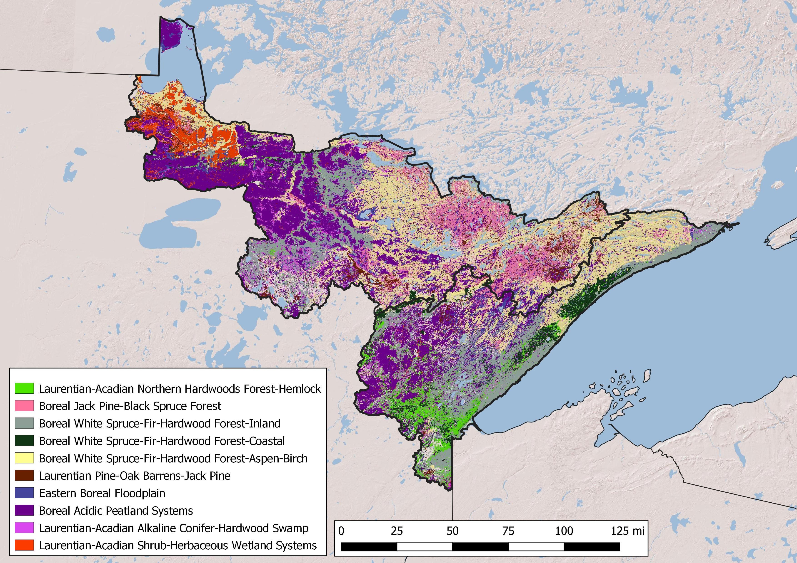

```{r setup, include=FALSE}
knitr::opts_chunk$set(echo = TRUE)
```

## The basics

There is a need to explore basic tree demographic data for TNC's restoration sites in northern Minnesota.  Based of the dataset [CLEAN_data_Fall2022_from_NM.xlsx](data/CLEAN_data_Fall2022_from_NM.xlsx) I:

1. Used pivot tables to generate clean [overstory](data/overstory.csv) and [understory](data/understory.csv) datasets
2. Made some basic data exploration charts

## Future hopes

1. Have clickable map
2. Explore treatment impacts on  basal area and # understory dbh


<br>

***

<br>

{width=100%}